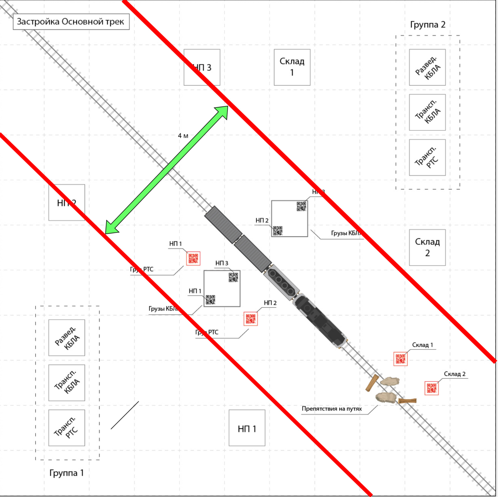

# competitions_0225

Текст ниже будет изменяться. Опираться необходимо на первоисточник - регламент 
соревнования.

Репозиторий с кодом для выполнения конкурсного задания.

Этот репозиторий - пример, как можно использовать pion в работе с дронами.
Вас не ограничивают в использовании других модулей или другого кода, если вы думаете, что это
сработает лучше, но необходимо опираться на регламент.

## Описание работы

Вам необходимо дополнить код: написать функцию main, которая выполнит
задание согласно регламенту. Если вы присылаете специфичный код, прописывайте
ваш файл requirements.txt обязательно.

Из кода вырезаны строки некоторых методов:

- DroneScanner.execute_scan()
- DroneScanner.scanned_qr()
- MissionController.run_mission()

Вам необходимо разобраться с функцией main: как использовать класс MissionController 

В классе MissionController есть weather_monitor, который работает по таймерам. 
Вам необходимо также переписать этот метод и использовать эту конструкцию для возврата на базу.
Обратите внимание, что логика возврата на базу реализована только для дрона сканера. Вам необходимо
использовать общий Event для дрона доставщика. Также интересный факт, если вы хотите обрабатывать метод из
Pion.goto_from_outside(), то используйте поле Pion.point_reached для выхода из цикла while для достижения таргетной
точки.

## Работа с симулятором
В geoscan simulator используется другой класс для взятия кадров.
Ниже представлен пример взятия видеопотока.

```python
from rzd import *
import cv2

def main():
    # Используем камеру с IP и портом, соответствующими симулятору
    camera = SocketCamera(ip="127.0.0.1", port=18001)
    while True:
        frame = camera.get_cv_frame()
        if frame is not None:
            cv2.imshow("Socket Camera", frame)
        # Нажмите ESC для выхода
        if cv2.waitKey(1) == 27:
            break
    cv2.destroyAllWindows()


if __name__ == "__main__":
    main()

```

## Пример получения статуса погоды
Это пример того, как со спутника забирать картинку с цветовой индикацией погоды

```python
import requests
import numpy as np
from PIL import Image
from io import BytesIO

# URL эндпоинта, который возвращает изображение
url = "http://127.0.0.1:8003/get_weather"

# Выполняем GET-запрос
response = requests.get(url)

# Проверяем, что запрос успешен
if response.status_code == 200:
    # Открываем изображение с помощью PIL
    image = Image.open(BytesIO(response.content))

    # Преобразуем изображение в массив NumPy
    image_np = np.array(image)

    # Получаем размеры изображения
    height, width, _ = image_np.shape

    # Извлекаем цвет из нижнего правого угла
    bottom_right_pixel = image_np[height - 1, width - 1]

    # Цвет в формате BGR (если изображение в формате BGR, как в OpenCV)
    r, g, b = bottom_right_pixel

    print(f"Цвет в нижнем правом углу (BGR): ({b}, {g}, {r})")
else:
    print(f"Ошибка: {response.status_code}")
```

## Схема площадки


# Важные замечания

Функция вызывается, если вы за детектировали detect_code при сканировании или при доставке.

```python

def detect_object(drone: Pion, detect_code: str) -> None:
    """
    Функция вызывается, если вы за детектировали detect_code при сканировании или при доставке

    :param drone: объект дрона
    :type drone: Pion

    :param detect_code: Строка со значением из qr кода
    :type detect_code: str

    :rtype: None
    """
    print("detect_object(), ip: ", drone.ip, "detect_code: ", detect_code)
    try:
        requests.get("http://10.1.100.6:31556/detect_object",
                     params={
                         "object": f"{detect_code.replace(" ", "_")}",
                         "host": drone.ip[-3:]
                     }).text
    except:
        print("Геймкор выключен")
```


Функция вызывается, если вы сели на qr код (для дрона доставщика).

```python

def get_box(drone: Pion) -> None:
    """
    Функция вызывается, если вы сели на qr код (для дрона доставщика)

    :param drone: объект дрона
    :type drone: Pion

    :rtype: None
    """
    print("get_box(), ip: ", drone.ip)
    try:
        requests.get("http://10.1.100.6:31556/get_box",
                     params={"host": drone.ip[-3:]}).text
    except:
        print("Геймкор выключен")
```

Функция вызывается, если вы сбрасываете груз.

```python
def drop_box(drone: Pion) -> None:
    """
    Функция вызывается, если вы сбрасываете груз

    :param drone: объект дрона
    :type drone: Pion

    :rtype: None
    """
    print("drop_box(), ip: ", drone.ip)
    try:
        requests.get("http://10.1.100.6:31556/drop_object",
                     params={"host": drone.ip[-3:]}).text
    except:
        print("Геймкор выключен")
```

Данные примеры уже добавлены в код и вы можете их использовать у себя. 

Это важная часть, которая влияет на зачисление баллов.